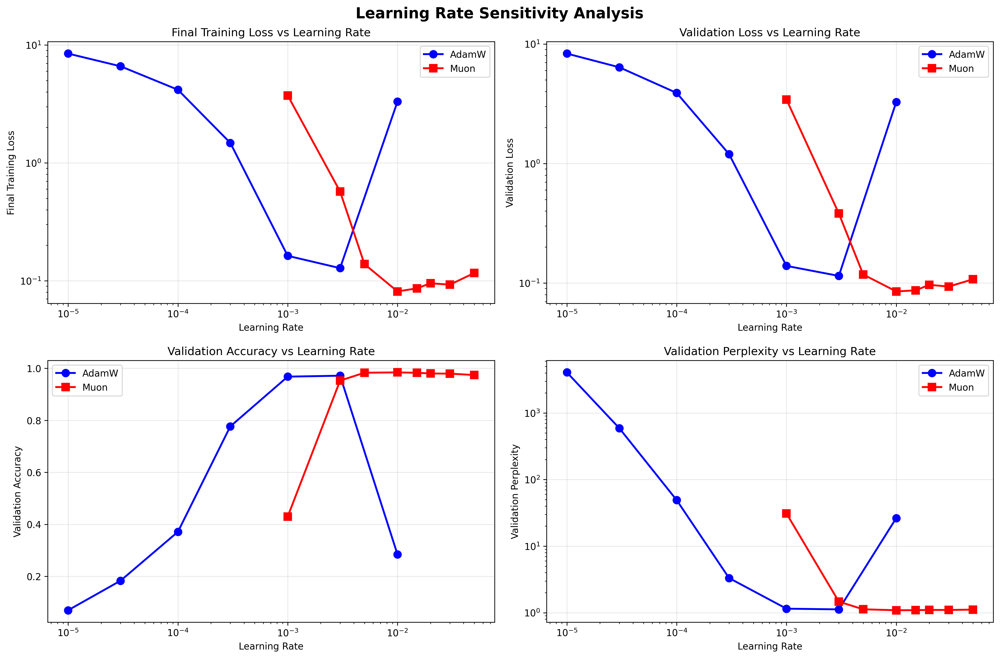
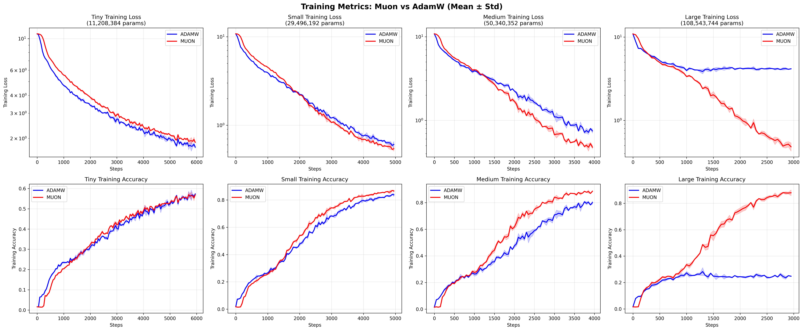

# Scaling Dynamics of Muon versus AdamW: An Empirical Analysis of Optimizer Performance in Transformer Language Models

🚀 **TL;DR**: Muon optimizer shows superior robustness and scaling performance over AdamW! 🔥  
🧠 **Gradient orthogonalization** makes Muon resilient to hyperparameter choices 🎯  


*AdamW (blue) has sharp peaks, Muon (red) shows broader stability across learning rates*

  
*Muon maintains strong performance with the same learning rate across multiple scales, showing superior robustness*


*The dramatic divergence: Muon scales beautifully while AdamW crashes at 108M parameters due to sensitivity to a wrong learning rate*

## 🎯 Key Findings

- 🔴 **Muon's robustness shines at scale**: Maintains 94.6% accuracy even with suboptimal hyperparameters
- 🟦 **AdamW's brittleness exposed**: Catastrophic failure when learning rate doesn't match model scale  
- ⚙️ **Only 4-5% compute overhead** for Muon's orthogonalization benefits
- 📈 **Broader learning rate tolerance** makes Muon more reliable in practice
- 💡 **Gradient conditioning** provides stability as models grow

## 🚀 Run the Experiments

### Recommended: High-Performance Training with Novita AI
[**Novita AI RTX 4090**](https://novita.ai/?ref=mjqyndm&utm_source=affiliate) - **4x faster** than free Colab! You lose nothing, I get 10% commission to support more research like this! 

### Alternative: Google Colab (Free)
[](https://colab.research.google.com/github/vukrosic/muon-optimizer-research/blob/main/muon_vs_adamw_for_llms.ipynb)

**Experiment Details:**
- **First experiment** (learning rate search): Runs fine on Google Colab free tier
- **Second experiment** (model scaling): May require model size adjustments on free Colab - use AI to help modify the code!

### Download & Run Locally
```bash
# Download the notebook
wget https://raw.githubusercontent.com/vukrosic/muon-optimizer-research/main/muon_vs_adamw_for_llms.ipynb

# Or just download: muon_vs_adamw_for_llms.ipynb
```

## 📄 Full Paper

This repository contains the complete LaTeX source for our empirical study:

**"Scaling Dynamics of Muon versus AdamW: An Empirical Analysis of Optimizer Performance in Transformer Language Models"**

> **Authors**: Vuk Rosić (Óbuda University), Claude (Anthropic)  
> **Date**: July 21, 2025

## 🧪 Methodology

- **4 Model Sizes**: 11M → 29M → 50M → 108M parameters
- **Dataset**: SmolLM-Corpus (500k tokens)
- **Architecture**: Decoder-only Transformers with RoPE, RMSNorm, SwiGLU
- **Statistical Rigor**: Multiple seeds, t-tests for significance

## 📊 Results Summary

| Model Size | AdamW Accuracy | Muon Accuracy | Muon Advantage |
|------------|---------------|---------------|----------------|
| 11M        | 79.4%         | 78.4%         | -1.3% (small models) |
| 29M        | 95.0%         | **96.3%**     | +1.4% ✅    |
| 50M        | 91.7%         | **96.1%**     | +4.8% ✅    |
| 108M       | **28.4%** 💥  | **94.6%** 🚀  | **Robust at scale** 🔥 |

*Note: AdamW's poor performance at 108M reflects learning rate sensitivity, while Muon maintains strong performance*

## 📂 Repository Structure

```bash
.
├── muon_vs_adamw_for_llms.ipynb    # 🚀 Main experiment notebook
├── results/                        # 📈 All plots and figures
│   ├── experiment_1_learning_rate/
│   └── experiment_2_model_size/
├── main.tex                       # 📄 Full LaTeX paper
└── README.md                      # 📖 You're here!
```

## 🔬 Key Insights

1. **Robustness at Scale**: Muon maintains performance even with suboptimal hyperparameters
2. **Gradient Orthogonalization**: Newton-Schulz iteration provides stability benefits
3. **Learning Rate Tolerance**: Muon's broader stability range improves reliability
4. **Practical Value**: Small compute overhead for significant robustness gains

## 📚 Citation

```bibtex
@misc{rosic2025muon,
  title={Scaling Dynamics of Muon versus AdamW: An Empirical Analysis of Optimizer Performance in Transformer Language Models},
  author={Rosić, Vuk and Claude},
  year={2025},
  url={https://github.com/vukrosic/muon-optimizer-research}
}
```

## 🤝 Support This Research

If this work helps you, consider:
- ⭐ **Star this repo**
- 🔄 **Share with your ML community** 
- ☕ **Use my [Novita AI link](https://novita.ai/?ref=mjqyndm&utm_source=affiliate)** for GPU training (supports more research!)

## 📬 Contact

Questions? Collaborations? Reach out!

**Vuk Rosić** – [vukrosic1@gmail.com](mailto:vukrosic1@gmail.com)

---
*Revolutionizing LLM training with robust optimization* 🚀