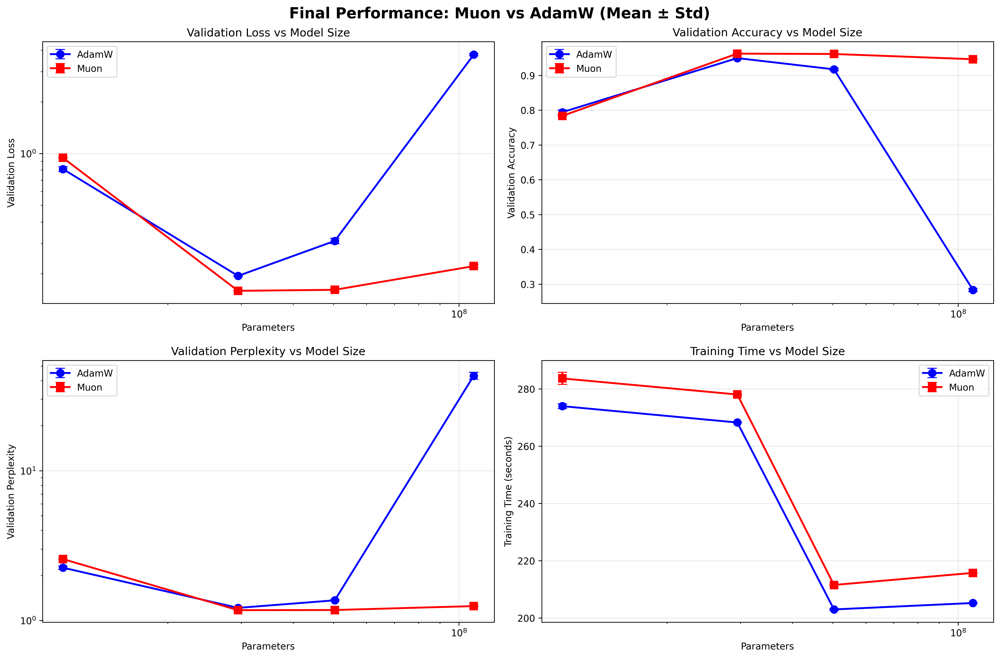
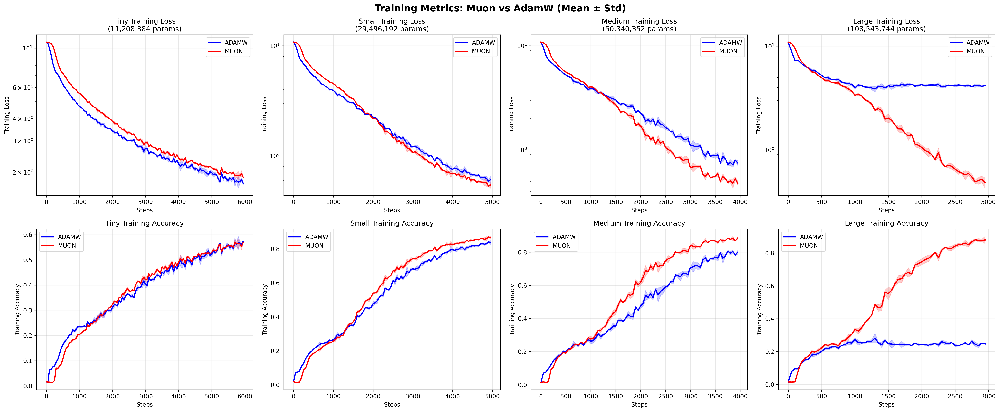

# Muon vs AdamW：小参数量大模型的学习率与扩展性研究

🌐 [English](README.md) | 🈶 中文

🚀 **一句话总结**：Muon 优化器相比 AdamW 展现出更强的鲁棒性与扩展能力！🔥  
🧠 **梯度正交化**让 Muon 对超参数更宽容 🎯  

  
*AdamW（蓝色）峰值尖锐，Muon（红色）在宽学习率范围内保持平稳*

  
*相同学习率下，Muon 在多尺度上都能保持强劲性能，鲁棒性显著*

  
*戏剧性分化：Muon 优雅扩展，AdamW 在 108 M 参数时因学习率不当而崩溃*

## 🎯 核心发现

- 🔴 **Muon 在大模型上稳健依旧**：即使超参数并非最优，仍保持 94.6 % 准确率  
- 🟦 **AdamW 的脆弱暴露**：学习率若与模型规模不匹配，直接崩到 28 % 准确率  
- ⚙️ **仅 4–5 % 计算开销**即可换取梯度正交化带来的稳定性  
- 📈 **更宽的学习率容忍区间**，使 Muon 在实际调参中更可靠  
- 💡 **梯度条件化**随着模型增大持续提供稳定性

## 🚀 一键复现实验

### 推荐：Novita AI 高性能训练
[**Novita AI RTX 4090**](https://novita.ai/?ref=mjqyndm&utm_source=affiliate) – 比免费 Colab **快 4 倍**！你无额外成本，我获 10 % 返佣用于后续研究！

全部代码已打包在 `muon_vs_adamw_for_llms.ipynb`，直接下载即可。

### 备选：Google Colab（免费）
[](https://colab.research.google.com/github/vukrosic/muon-optimizer-research/blob/main/muon_vs_adamw_for_llms.ipynb)

实验说明：  
- **实验一（学习率搜索）**：免费 Colab 即可跑完  
- **实验二（模型扩展）**：免费 Colab 可能显存不足——可把代码丢给 AI 帮你裁剪模型规模！

### 本地运行
```bash
# 直接下载 notebook
wget https://raw.githubusercontent.com/vukrosic/muon-optimizer-research/main/muon_vs_adamw_for_llms.ipynb
```

## 📄 完整论文

本项目包含完整 LaTeX 源码、代码与 PDF 报告：

**《Muon vs AdamW：小参数量大模型的学习率与扩展性研究》**  
作者：Vuk Rosić（Óbuda University）、Claude（Anthropic）  
日期：2025-07-22

## 🧪 研究方法

- **4 种模型规模**：11 M → 29 M → 50 M → 108 M 参数  
- **数据集**：SmolLM-Corpus（50 万 tokens）  
- **架构**：仅解码器 Transformer，含 RoPE、RMSNorm、SwiGLU  
- **统计严谨性**：多随机种子 + t 检验显著性

## 📊 结果一览

| 模型规模 | AdamW 准确率 | Muon 准确率 | Muon 优势 |
|----------|--------------|-------------|-----------|
| 11 M     | 79.4 %       | 78.4 %      | –1.3 %（小模型略逊） |
| 29 M     | 95.0 %       | **96.3 %**  | +1.4 % ✅ |
| 50 M     | 91.7 %       | **96.1 %**  | +4.8 % ✅ |
| 108 M    | **28.4 %** 💥| **94.6 %** 🚀| **大模型稳健** 🔥 |

> 注：108 M 时 AdamW 因学习率不匹配而崩溃，Muon 保持高准确率

## 📂 仓库结构

```bash
.
├── muon_vs_adamw_for_llms.ipynb    # 🚀 主实验 notebook
├── results/                        # 📈 图表结果
│   ├── experiment_1_learning_rate/
│   └── experiment_2_model_size/
├── muon_vs_adamw_for_llms.tex     # 📄 完整 LaTeX 论文
└── README.md                      # 📖 你正在看的中文版
```

## 🔬 深度洞察

1. **规模越大越稳健**：即使超参数不完美，Muon 依旧性能在线  
2. **梯度正交化**：Newton-Schulz 迭代带来稳定性红利  
3. **学习率宽容**：更宽的稳定区间提升工程可靠性  
4. **实用价值**：4–5 % 额外计算换取显著鲁棒性，性价比极高

## 📚 引用

```bibtex
@misc{rosic2025muon,
  title={Muon vs AdamW：小参数量大模型的学习率与扩展性研究},
  author={Rosić, Vuk and Claude},
  year={2025},
  url={https://github.com/vukrosic/muon-optimizer-research}
}
```

## 🤝 支持本研究

如果觉得有用，欢迎：

- ⭐ **给仓库点星**  
- 🔄 **转发到你的 ML 社群**  
- ☕ **通过[我的 Novita AI 链接](https://novita.ai/?ref=mjqyndm&utm_source=affiliate)租用 GPU**（支持后续研究！）

## 📬 联系

任何疑问或合作意向，欢迎来信！

**Vuk Rosić** – vukrosic1@gmail.com

---
*用稳健优化重塑大模型训练* 🚀